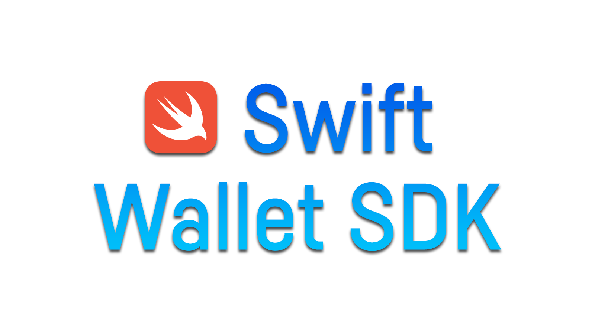

With the Swift Wallet SDK, building an iOS Stellar-enabled wallet or application will be faster and easier than ever. The Swift Wallet SDK is currently work in progress and will extend the [Stellar Wallet SDK Family](https://stellar.org/products-and-tools/wallet-sdk).

> **Note:**
All features that have already been implemented are documented [here](https://github.com/Soneso/stellar-swift-wallet-sdk/tree/main/docs). As soon as new features are implemented, this documentation will be expanded.

# Roadmap

### 1. Interacting with the Stellar Network

**Brief description:** Implementation of the features and api needed for communication with the Stellar Network as documented [here](https://developers.stellar.org/docs/build/apps/wallet/stellar).

**Status:** In progress


### 2. Stellar Authentication (SEP-10)

**Brief description:** Wallets connect to anchors using a standard way of authentication via the Stellar network defined by the [SEP-10](https://github.com/stellar/stellar-protocol/blob/master/ecosystem/sep-0010.md) standard. 
This milestone will contain all the components required for SEP-10 Authentication with Anchors as documented [here](https://developers.stellar.org/docs/build/apps/wallet/sep10).

**Status:** To do


### 3. Hosted Deposit and Withdrawal (SEP-24)

**Brief description:** The [SEP-24](https://github.com/stellar/stellar-protocol/blob/master/ecosystem/sep-0024.md) standard defines the standard way for anchors and wallets to interact on behalf of users. Wallets use this standard to facilitate exchanges between on-chain assets (such as stablecoins) and off-chain assets (such as fiat, or other network assets such as BTC). This milestone will cover the SEP-24 flow as documented [here](https://developers.stellar.org/docs/build/apps/wallet/sep24).

**Status:** To do


### 4. Quotes (SEP-38)

**Brief description:** The [SEP-38](https://github.com/stellar/stellar-protocol/blob/master/ecosystem/sep-0038.md) standard defines a way for anchors to provide quotes for the exchange of an off-chain asset and a different on-chain asset, and vice versa. This milestone will cover the SEP-38 flow as documented [here](https://developers.stellar.org/docs/build/apps/wallet/sep38).

**Status:** To do


### 5. KYC API (SEP-12)

**Brief description:** [SEP-12](https://github.com/stellar/stellar-protocol/blob/master/ecosystem/sep-0012.md) defines a standard way for stellar clients to upload KYC (or other) information to anchors and other services. 
Our SEP-6 implementation will use this protocol, but it can serve as a stand-alone service as well. This milestone will cover the SEP-12 flow as documented [here](https://developers.stellar.org/docs/build/apps/wallet/sep6#providing-kyc-info).

**Status:** To do


### 6. Programmatic Deposit and Withdrawal (SEP-06)

**Brief description:** The [SEP-06](https://github.com/stellar/stellar-protocol/blob/master/ecosystem/sep-0006.md) standard defines a way for anchors and wallets to interact on behalf of users. 
Wallets use this standard to facilitate exchanges between on-chain assets (such as stablecoins) and off-chain assets 
(such as fiat, or other network assets such as BTC). See Wallet SDK docs [here](https://developers.stellar.org/docs/build/apps/wallet/sep6).

**Status:** To do


### 7. Recovery (SEP-30)

**Brief description:** The [SEP-30](https://github.com/stellar/stellar-protocol/blob/master/ecosystem/sep-0030.md) standard defines the standard way for an individual 
(e.g., a user or wallet) to regain access to their Stellar account after losing its private key without providing any third party control of the account. During this flow the wallet communicates with one or more recovery 
signer servers to register the wallet for a later recovery if it's needed. See Wallet SDK docs [here](https://developers.stellar.org/docs/build/apps/wallet/sep30).

**Status:** To do


# Quick Start

## Installation

Copy the link of the repository (https://github.com/Soneso/stellar-swift-wallet-sdk) and then go to your `Xcode project` -> right click on your project name -> `Add Package Dependencies` … Paste the repository link on the Search, choose the package than click on `Add Package` button. A new screen will shows up, just click `Add Package` button again. Two new Package dependencies will appear: `stellar-wallet-sdk` and `stellarsdk`. The Wallet SDK uses the base [iOS Stellar SDK](https://github.com/Soneso/stellar-ios-mac-sdk) (currently from the `await-async` branch).


After installation add following import statement to your swift file:

```swift
import stellar_wallet_sdk
```

## Working with the SDK

Let's start with the main class that provides all SDK functionality. It's advised to have a singleton wallet object shared across the application. Creating a wallet with a default configuration connected to Stellar's Testnet is simple:

```swift
let wallet = Wallet.testNet
```

The wallet instance can be further configured. For example, to connect to the public network:

```swift
let wallet = Wallet(stellarConfig: StellarConfig.publicNet)
```

If you want to find out more about wallet configuration, you can read the details in the documentation under [Wallet Configuration](./docs/wallet.md).

## Stellar Basics

The wallet SDK provides extra functionality on top of the existing Horizon SDK. For interaction with the Stellar network, the wallet SDK covers the basics used in a typical wallet flow. For more advanced use cases, the underlying Horizon SDK should be used instead.

To interact with the Horizon instance configured in the previous steps, simply do:

```swift
let stellar = wallet.stellar
```

This example will create a Stellar class that manages the connection to Horizon service.

Please read the [Interacting with Stellar](./docs/stellar.md) docs of the SDK to find out about all available features such as the account service, building transactions, all available operation types, signing and submitting transactions to Stellar, fetching Stellar Network data via Horizon and more.

## Anchor Basics

Primary use of the SDK is to provide an easy way to connect to anchors via sets of protocols known as SEPs such as:

- SEP-01: [Stellar Info File](https://github.com/stellar/stellar-protocol/blob/master/ecosystem/sep-0001.md)
- SEP-10: [Stellar Authentication](https://github.com/stellar/stellar-protocol/blob/master/ecosystem/sep-0010.md)
- SEP-24: [Hosted Deposit and Withdrawal](https://github.com/stellar/stellar-protocol/blob/master/ecosystem/sep-0024.md)
- SEP-06: [Programmatic Deposit and Withdrawal](https://github.com/stellar/stellar-protocol/blob/master/ecosystem/sep-0006.md)
- SEP-12: [Providing KYC info](https://github.com/stellar/stellar-protocol/blob/master/ecosystem/sep-0012.md)
- SEP-38: [Quotes](https://github.com/stellar/stellar-protocol/blob/master/ecosystem/sep-0038.md)

This functionality is not yet implemented. We will provide all details as soon as it is ready. Stay tuned!


#### Documentation and Test Cases

You can find the SDK documentation [here](https://github.com/Soneso/stellar-swift-wallet-sdk/tree/main/docs). 

We also recommend that you consult the code examples from the test cases, e.g. in the [Stellar Tests](https://github.com/Soneso/stellar-swift-wallet-sdk/blob/main/Tests/stellar-wallet-sdkTests/StellarTest.swift) of the SDK.

